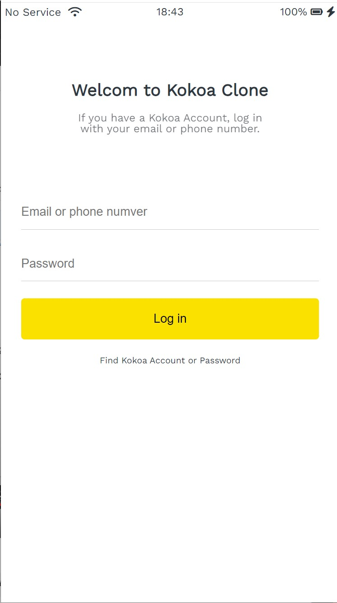
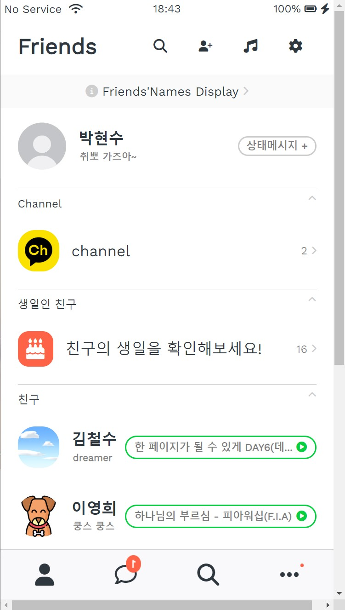

# Kokoa Clone 클론 코딩

### 🔭 preview

|Screen|Img|Screen|Img|
|:--:|:--:|:--:|:--:|
|로그인 화면| |친구 목록| |

### [👉link](https://redbuttonking.github.io/kokoa-clone-2023/index.html)

# 1. 프로젝트 소개

 자세히 

## 목적
> **1. HTML과 CSS의 기초를 배우고 탄탄하게 하기 위함**  
> **2. 배운 강의를 토대로 모바일 카카오톡의 UI 클론 코딩**  
> **3. 기존 배운것들과 강의 내용을 가지고 응용 학습**

## 프로젝트 구조

### - 공통적으로 있는 부분

### 구조
- 상단 바 
  - No Service
  - 와이파이 아이콘
  - 시간
  - 배터리
- 하단 바 (네비게이션)
  - friends
  - chats
  - find
  - more
- header 
  - 페이지 이름
  - 돋보기
  - 친구추가
  - 음악
  - 설정

### 기능
- header 부분에 있는 기어(설정)을 누르면 setting.html로 넘어감 
- 처음 들어갈때 하단 바가 하나씩 올라오는 애니매이션을 넣음
- 기어(설정) 아이콘에 hover 애니매이션을 넣음 (`@keyframes rotateGear`)
- 하단 바을 누르면 각 아이콘에 맞게 페이지로 이동함 (친구,채팅,더보기,설정)
- 채팅 아이콘에 배지(badge)를 달고 움직이는 애니매이션을 넣음 (`@keyframes notificationAnimation`)

___
### - 로그인 화면 _ index.html

### 구조
- 상단 바
- 이메일 입력 창
- 패스워드 입력 창
- 로그인 버튼

### 기능
- 입력창에 값을 넣지 않으면 로그인이 되지 않음

___
### - 친구 목록 _ friends.html

### 구조
- 프로필 
- 채널
- 생일인 친구
- 친구목록
  - 이름
  - 상태메세지
  - 프로필 뮤직 

___
### - 채팅 목록 _ chats.html

### 구조
- 채팅방(개인, 단체, 서비스공지)  
  - 프로필 사진
  - 이름
  - 마지막 보낸 메시지    
  - 시간
  - 새로운 알림
  - 무음
  - 인원수

### 기능
- 클릭시 채팅방(chat.html,chat-kokoa.html)으로 넘어감  
  => 박현수, 코코아톡

___
### - 채팅(박현수) _ chat.html

### 구조
- 채팅방 header (뒤로가기, 이름, 검색&더보기)
- 날짜 및 시간
- 프로필
- 이름
- 메시지
- 입력창

### 기능
- 입력창 애니매이션 적용(focus)
  - transform  
  => 채팅창 늘어남(translateX, 채팅창 뒤 bar 내려감)

___
### - 채팅(코코아톡) _ chat-kokoa.html

### 구조
- 채팅방 header (뒤로가기, 이름, 검색&더보기)
- 날짜 및 시간
- 프로필
- 이름
- 메시지(알림)
- 하단 바(채널 홈 바로가기)

___
### - 찾기 _ find.html

### 구조
- 아이콘
  - QR
  - 연락처 추가
  - ID 추가
  - 초대
- 추천 친구
  - 안내문구 ("추천 친구가 없음")
- 오픈 채팅
  - #태그
  - 이미지
  - 좋아요(❤)

### 기능
- ❤ 애니매이션 적용(hover)  
  => 하트 색 변경 및 크기 조정(infinite)
___
### - 더보기 _ more.html

### 구조
- 프로필
  - 이름
  - 번호
  - 알림 아이콘
  - 말풍선
- 아이콘
  - 캘린더
  - 톡 드라이브
  - 이모티콘
  - 계좌
  - 오픈채팅
  - 테마
- Suggestions
  - 카카오스토리
  - 카카오 리눅스
  - 카카오 젬

___
### - 설정 _ settings.html

### 구조
- 공지사항
- 실험실
- 버전  
 => Latest Version
- 보안
- 알림
- 친구
- 채팅
- 디스플래이
- 테마  
  => Default theme

[👆맨위로👆](#1-프로젝트-소개)
  

# 2. 프로젝트를 마치며...

 느낀점 

---
학교에서 웹 프로그래밍을 배웠지만 JS 위주로 강의하셔서 HTML과 CSS를 깊게 배우지는 못했다.(초 초 초 간단하게 배움) 
그래서 이번 배움에 있어서 웹 기초를 처음으로 맞이하는 시간이었다.   

HTML과 CSS를 다루는 방법과 ID,Class사용, CSS를 이용해 애니메이션 적용, 많이 사용하는 HTML태그와 태그들과의 관계(부모,자식,형제),
프로젝트 관리(폴더화), 깃허브 저장 및 깃허브 데스크탑 사용(브랜치 사용 방법), URL생성 등 웹 프로그래밍 말고도 저장소 사용과 앞으로 개발할 때 구조를 어떻게 나누어서 파일들을 관리하는지도 배우게 됐다.   
  
프로젝트를 하는 데에 있어서 모든 것이 순탄치 않았다. 
CSS 선택자들에서 애를 먹기도 하고 클론 코딩이다 보니 HTML 구조를 어디서 어떻게 짜야 하는지 막막했었다.
그렇다고 쉽게 포기하지는 않았다. 다 만들어서 완성하는 날을 고대하며 하나씩 차근차근 개발해 나갔다.
어렵거나 막히는 부분에선 구글에 검색하기도 하고 친구들에게 물어봐서 조언을 구하기도 했었다. 
배운 것을 가지고 응용해 새로운 것을 만들기도 하고 추가도 했었다.
완성된 프로젝트를 봤을 때는 매우 뿌듯했다.

이번 프로젝트를 하면서 배움도 배움이지만 많은 것을 느꼈다.
공부하고 개발하는 데에 있어서 잘 안되고 어려움을 겪을 때 가만히 있다고 되는 건 아니었다.
조금씩 목표를 설정해서 하나씩 이뤄가는 것이 지혜롭다고 느꼈다. 
그리고 *"안되는 건 없다."* 라는걸 느꼈다. (컴퓨터는 틀리지 않는다. 나만 틀릴 뿐....ㅎ)
앞으로 프로젝트와 배움에 있어서 이번에 느낀 것을 잘 적용해 가야겠다.

